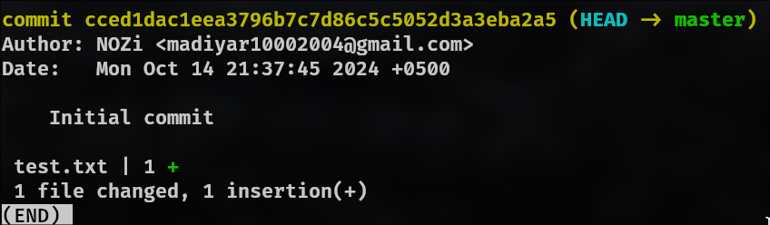

#  1. Основы Linux

```sh
# Создание директории devops_test в домашнем каталоге
mkdir ~/devops_test 
# Создание пустого файла readme.txt в созданной директории
cd ~/devops_text
touch readme.txt
# Создание пустого файла readme.txt в созданной директории
pwd
```


# 2. Основы Git

```sh
# Создайте новый локальный репозиторий.
mkdir test
cd test
git init

# Создайте файл test.txt, добавьте в него текст “Hello DevOps”.
touch test.txt
echo "Hello DevOps" > test.txt

# Закоммитьте изменения с сообщением “Initial commit”.
git add test.txt
git commit -m "Initial commit"

# Покажите историю коммитов
git log --stat
```




# 3. Основы сетевых технологий

- Что такое IP-адрес и для чего он используется?

```
IP-адрес это 4 числа от 0 до 255 разделенных точкой по типу 123.123.123.123
Они выполняют роль идентификации устройств в сети.
```

- Назовите основные отличия между протоколами TCP и UDP

```
TCP обеспечивает надежную передачу данных, а UDP не гарантирует доставку данных и не проверяет, были ли они получены.
```

# 4. Программирование (Bash или Python)

- Напишите скрипт на Bash или Python, который выводит числа от 1 до 10.


# 5. Логическое мышление

- В одном здании находится три лампочки, управляемые тремя выключателями в другой комнате. Как определить, какой выключатель к какой лампочке относится, если вы можете зайти в комнату с лампочками только один раз?

```
Включить две лампочки, немног подождать(пока не прогреется), вырубить одну.
И идти проверять, та что горить понятно где, вторую на ощуп понять, та что
теплее и есть ту которую вырубили.
```
